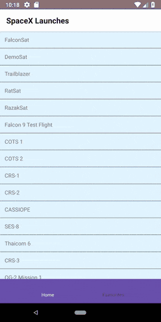

# rn-space-x
React Native sample app showing a list of SpaceX launches as a list with a favourites list.

The app fetches a list of SpaceX launches from an endpoint, then displays them as a FlatList.
Pressing one of the list elements opens a details page where items can be added to a favourites list.

## Technologies used
- [React Native](https://facebook.github.io/react-native/)
- [React Navigation](http://reactnavigation.org/)
- [Redux](https://redux.js.org)

## Demo

## Build the app

- `npm i`
- `npm start`
- `react-native run-android`